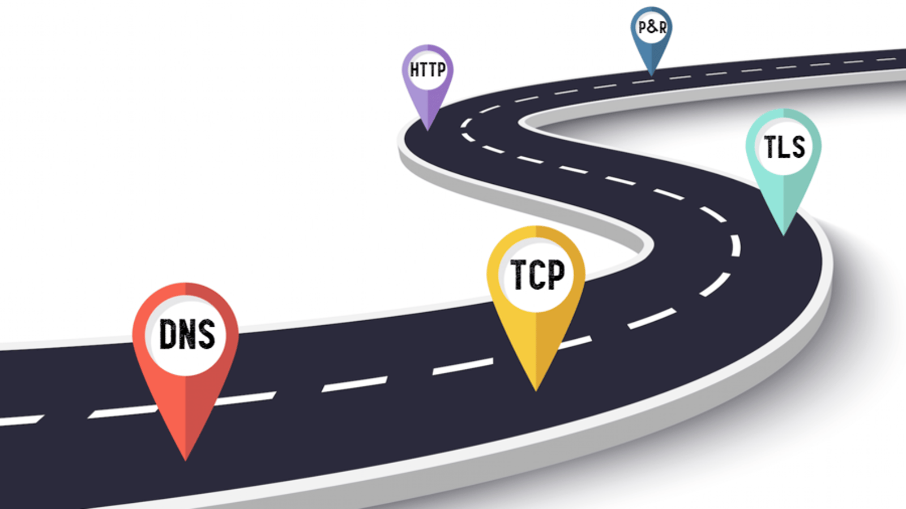
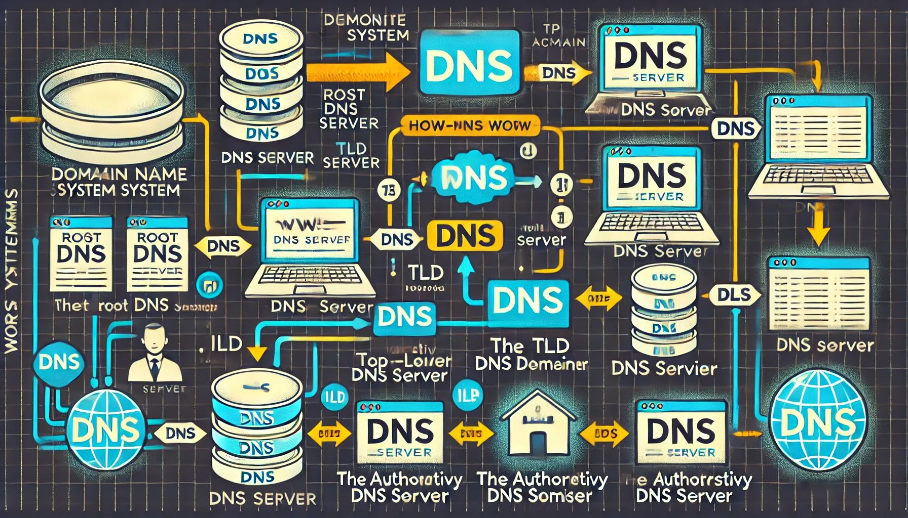

<a href="#">
    <h1 align="center"> Blogs Archive </h1>
</a>

    Showcase of my journey to building a solid Foundation.

 &nbsp;&nbsp;  &nbsp;&nbsp;  &nbsp;&nbsp;

## The Following are some of my most famous blogs

 

### [From Browsers to Servers : The Journey of Your Data](https://browsers-to-servers.hashnode.dev/from-browsers-to-servers-the-journey-of-your-data)

<a href="https://browsers-to-servers.hashnode.dev/from-browsers-to-servers-the-journey-of-your-data">
      

      
    

</a>
 

### [From Domain to IP : DNS Magic and Internals](https://dns-magic.hashnode.dev/from-domain-to-ip-dns-magic-and-internals)

<a href="https://dns-magic.hashnode.dev/from-domain-to-ip-dns-magic-and-internals">
      

      
    

</a>
 

### [The TCP 3-way Handshake: What it is and Why it is Important ?](https://tcp-handshake.hashnode.dev/the-tcp-3-way-handshake-what-it-is-and-why-it-is-important)

<a href="https://tcp-handshake.hashnode.dev/the-tcp-3-way-handshake-what-it-is-and-why-it-is-important">
      

      
    

</a>
 

### [HTML for Beginners : Building the Skeleton of a Webpage](https://html-guide.hashnode.dev/html-for-beginners-building-the-skeleton-of-a-webpage)

<a href="https://html-guide.hashnode.dev/html-for-beginners-building-the-skeleton-of-a-webpage">
      

      
    

</a>
 

### [Valentines Special : Learn some common JavaScript Array methods](https://instroduction-to-javascript.hashnode.dev/valentines-special-learn-some-common-javascript-array-methods)

<a href="https://instroduction-to-javascript.hashnode.dev/valentines-special-learn-some-common-javascript-array-methods">
      

      
    

</a>
 

### [Polyfills :- Making JavaScript workable in every browser](https://instroduction-to-javascript.hashnode.dev/polyfills-making-javascript-workable-in-every-browser)

<a href="https://instroduction-to-javascript.hashnode.dev/polyfills-making-javascript-workable-in-every-browser">
      

      
    

</a>
 

## To See all my Articles Please Visit my profile by click picture below

<a href="https://hashnode.com/@Sanketsingh78">
      

      
    

</a>
 
